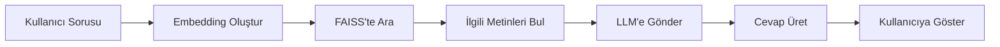

# 🌍 Avrupa Tur Rehberi Chatbot

Avrupa şehirleri hakkında gerçek zamanlı bilgi sağlayan yapay zeka destekli seyahat danışmanı. RAG (Retrieval-Augmented Generation) mimarisi kullanarak Wikipedia verilerinden akıllı cevaplar üretir.


---

## 🌐 Canlı Demo

**🔗 Demo Linki:** [https://huggingface.co/spaces/Gizem08/european-travel-chatbot](https://huggingface.co/spaces/Gizem08/european-travel-chatbot)

**🎥 Video Demo:** [YouTube Linki](YOUR_VIDEO_LINK)

---

## ✨ Özellikler

- 🤖 **Akıllı Chatbot** - Gradio tabanlı web arayüzü
- 📚 **Gerçek Zamanlı Veri** - Wikipedia entegrasyonu ile güncel bilgi
- 🔍 **Semantic Search** - FAISS vektör veritabanı ile anlamsal arama
- 🌍 **40+ Avrupa Şehri** - Geniş şehir kapsama alanı
- 🇹🇷 **Türkçe Destek** - Türkçe konuşarak yanıt verir
- ⚡ **Hızlı & Ücretsiz** - Groq API ile yüksek hız

---

## 🏙️ Desteklenen Şehirler

### Batı Avrupa
🇬🇧 Londra | 🇫🇷 Paris | 🇧🇪 Brüksel | 🇳🇱 Amsterdam | 🇱🇺 Lüksemburg | 🇲🇨 Monako

### Kuzey Avrupa
🇳🇴 Oslo | 🇸🇪 Stockholm | 🇩🇰 Kopenhag | 🇫🇮 Helsinki | 🇮🇸 Reykjavik | 🇪🇪 Tallinn | 🇱🇻 Riga | 🇱🇹 Vilnius

### Güney Avrupa
🇵🇹 Lizbon | 🇪🇸 Madrid, Barselona, Valencia | 🇮🇹 Roma, Milan | 🇬🇷 Atina | 🇲🇹 Valletta | 🇷🇸 Belgrad | 🇭🇷 Zagreb | 🇧🇦 Sarajevo | 🇦🇱 Tiran | 🇲🇪 Podgorica

### Orta Avrupa
🇦🇹 Viyana | 🇩🇪 Berlin, Munih, Hamburg | 🇨🇭 Bern | 🇨🇿 Prag | 🇸🇰 Bratislava | 🇭🇺 Budapeşte | 🇸🇮 Ljubljana

### Doğu Avrupa
🇧🇾 Minsk | 🇷🇺 Moskova | 🇺🇦 Kiev | 🇲🇩 Chişinău | 🇧🇬 Sofya | 🇷🇴 Bükreş | 🇵🇱 Varsova

---

## 🚀 Kurulum

### Gereksinimler

- Python 3.8 veya üzeri
- Groq API Key (ücretsiz: [console.groq.com](https://console.groq.com/keys))

### Adım 1: Projeyi Klonla

```bash
git clone https://github.com/KULLANICI_ADIN/european-travel-chatbot.git
cd european-travel-chatbot
```

### Adım 2: Bağımlılıkları Yükle

```bash
pip install -r requirements.txt
```

### Adım 3: API Key Ayarla

`.env` dosyası oluştur ve API key'ini ekle:

```bash
cp .env.example .env
```

`.env` dosyasını düzenle:

```
GROQ_API_KEY=buraya_kendi_api_keyini_yaz
```

**API Key nereden alınır?**
1. https://console.groq.com/keys adresine git
2. Ücretsiz hesap oluştur (Google ile giriş)
3. "Create API Key" tıkla
4. Kopyala ve `.env` dosyasına yapıştır

### Adım 4: Uygulamayı Çalıştır

```bash
python app.py
```

### Adım 5: Tarayıcıdan Aç

Uygulama başladıktan sonra:
- **Lokal:** http://127.0.0.1:7860
- **Public Link:** Terminal'de görünecek Gradio linki

---

## 💬 Örnek Sorular

```
👤 "Roma'da 3 günde neler gezebilirim?"
🤖 [AI detaylı gezilecek yerler listesi verir]

👤 "Paris'te hangi müzeleri görmeliyim?"
🤖 [Louvre, Orsay gibi öneriler sunar]

👤 "Barselona'da ne yemeli?"
🤖 [Paella, tapas gibi yemekleri açıklar]

👤 "Amsterdam'da bisiklet kiralaması nasıl?"
🤖 [Bisiklet kiralama ve kullanma ipuçları]
```

---

## 🛠️ Teknoloji Yığını

| Teknoloji | Kullanım Amacı |
|-----------|----------------|
| **LangChain** | RAG framework ve chain yönetimi |
| **Groq Llama 3.3 70B** | Cevap üretimi (LLM) |
| **FAISS** | Vektör veritabanı ve semantic search |
| **Sentence Transformers** | Metin embedding (anlamsal vektörler) |
| **Gradio** | Web arayüzü |
| **Wikipedia API** | Gerçek zamanlı şehir bilgileri |
| **Python dotenv** | Ortam değişkenleri yönetimi |

---

## 📁 Proje Yapısı

```
european-travel-chatbot/
│
├── app.py                  # Ana uygulama dosyası
├── requirements.txt        # Python bağımlılıkları
├── .env.example           # Ortam değişkenleri şablonu
├── .gitignore             # Git ignore kuralları
├── README.md              # Bu dosya
│
└── screenshots/           # (Opsiyonel) Ekran görüntüleri
    ├── main_interface.png
    ├── roma_question.png
    └── paris_tourism.png
```

---

## 🔧 Nasıl Çalışır?

### RAG (Retrieval-Augmented Generation) Mimarisi



1. **Veri Toplama**: Wikipedia'dan 40+ şehir bilgisi çekilir
2. **Metin İşleme**: Uzun metinler 800 karakterlik parçalara bölünür
3. **Embedding**: Her parça sayısal vektöre dönüştürülür (384 boyutlu)
4. **Vektör Depolama**: FAISS veritabanında saklanır
5. **Kullanıcı Sorusu**: 
   - Soru vektöre dönüştürülür
   - En benzer 3 metin parçası bulunur (cosine similarity)
6. **LLM'e Gönder**: Bulunan metinler + soru Groq Llama 3.3'e gönderilir
7. **Cevap Üretimi**: AI bağlama uygun Türkçe cevap üretir

---

## 🎯 Kullanım Senaryoları

- 📖 **Seyahat Planlama** - Tatil öncesi araştırma
- 🎓 **Eğitim** - Coğrafya ve kültür öğrenimi
- 💼 **Turizm Sektörü** - Müşteri destek botu şablonu
- 🤖 **AI/ML Öğrenimi** - RAG mimari örneği


## ⚙️ Yapılandırma

### Model Ayarları

`app.py` dosyasında özelleştirilebilir:

```python
# LLM Ayarları
llm = ChatGroq(
    model="llama-3.3-70b-versatile",  # veya "mixtral-8x7b-32768"
    temperature=0.7                    # 0.0=deterministik, 1.0=yaratıcı
)

# Chunk Ayarları
text_splitter = RecursiveCharacterTextSplitter(
    chunk_size=800,        # Parça boyutu
    chunk_overlap=150      # Örtüşme miktarı
)

# Retrieval Ayarları
docs = vector_store.similarity_search(query, k=3)  # Kaç döküman çekilecek
```

### Yeni Şehir Ekleme

`cities` listesine ekle:

```python
cities = [
    "Roma", "Paris", "Barselona",
    "Yeni Şehir Adı"  # Buraya ekle
]

### Adım 4: API Key Ekle (Secret)

1. Space'de "Settings" sekmesi
2. "Repository secrets" → "New secret"
3. Name: `GROQ_API_KEY`
4. Value: Groq API key'iniz
5. "Add secret"


## 🐛 Sorun Giderme

### Build Hatası

**Hata:** `ModuleNotFoundError: No module named 'langchain_groq'`

**Çözüm:**
```bash
pip install --upgrade langchain-groq
```

### API Key Hatası

**Hata:** `GROQ_API_KEY not found`

**Çözüm:**
1. `.env` dosyasının doğru konumda olduğundan emin ol
2. API key'de boşluk olmadığını kontrol et
3. Yeni API key oluştur

### Yavaş Cevap

**Sebep:** Ücretsiz tier kullanıyorsun

**Çözümler:**
- Chunk size'ı küçült (800 → 500)
- Retrieved docs sayısını azalt (k=3 → k=2)
- Groq yerine ücretli tier kullan

---

